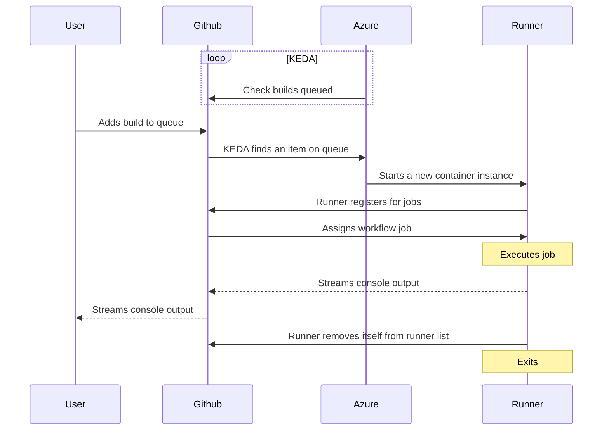

# azure-github-runners

Example setup of self-hosted ephemeral GitHub runners on top of Azure Container Apps Jobs. Contains Terraform code for automating the infrastructure and the container image needed for running the custom runner as a container.

> [!IMPORTANT]
> This example is intended as a minimum setup to get it working. If you are setting it up yourself, please take your own judgments on how it's best set up for your needs and requirements.

## How it works

On the Azure Container Apps job, KEDA continuously checks GitHub for queued workflow jobs. When a job appears, Azure Container Apps starts an ephemeral runner container, the runner registers, executes the job while streaming logs back to GitHub (and the user), then deregisters itself and exits.

## Auto scaling

The Azure Container Apps Jobs come with KEDA scaling software, which includes a GitHub runner scaler. We can take advantage of this to automatically add more runners when workflow runs are requested on GitHub. In this example, the scaler is configured to listen on one specific repository and uses a PAT for authentication. The scaler can listen to multiple repositories or even register the runner at the organization level. To support this, the scaler, startup script, and authentication will need to be reconfigured.

See all scaling options here: https://keda.sh/docs/2.20/scalers/github-runner/

> [!NOTE]
> Make sure you match the KEDA version in your container apps environment with the documentation version.

## GitHub Authentication

When running this example, two different authentications occur towards your account/organization from the container apps. First, it's the scaler that needs to be able to connect to your repositories and listen for new items in the build queue. The second authentication is the container itself when it registers in your organization or repository.

This example is set up with a PAT as the authentication method, because that's the quickest way to get the example running. Preferably, authentication should be set up with a GitHub App instead. Both authentications should use app authentication in a production setup. How to set this up is described here: https://keda.sh/docs/2.18/scalers/github-runner/#setting-up-the-github-app

## Tools

The base image with the GitHub runner software comes only with the bare essentials needed to run the runner. Any other tool that needs to be available on the runner when processing workflow requests must be added to the [container image](./src/Dockerfile).

## Container-based Actions

Actions that run as containers (for example `azure/cli`) will not work on this runner by default, because the runner itself runs in a container and is not started with access to a Docker daemon. Using container actions would require running the runner with Docker-in-Docker or a mounted Docker socket, which is intentionally not supported here.
